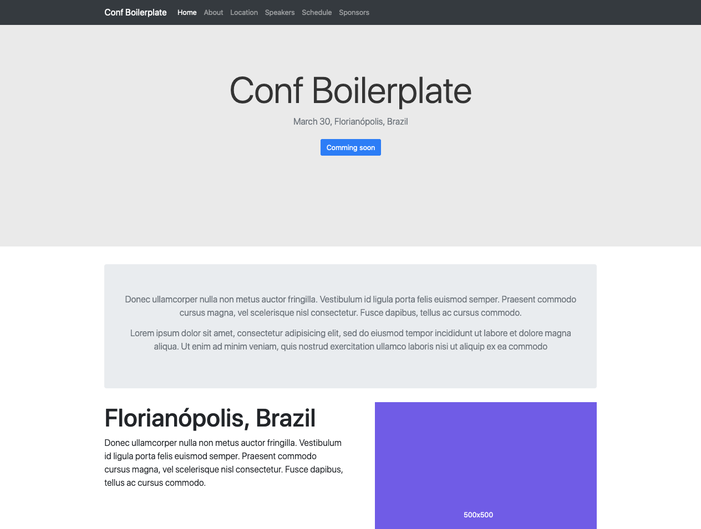

# Conf Boilerplate

This project pretend to be a simple, customizable and "backendless" conference website.



## Table of contents

* [Getting Started](#getting-started)
* [Author](#author)
* [License](#license)

## Getting Started

1. Install [git]() and [nodejs]() (if you don't have it installed)

2. Clone this repository

  ```sh
    $ git clone git@github.com:dvinciguerra/conf-boilerplate.git
  ```

3. Go to the project directory


  ```sh
    $ cd conf-boilerplate
  ```

4. Install dependencies using you favorite package manager (I prefer yarn =P)


  ```sh
    $ yarn install
  ```

5. If all dependencies are installed successfully, type the follow command to run application

  ```sh
    $ yarn run dev
  ```

## Author

* [Daniel Vinciguerra](https://github.com/dvinciguerra)

## License

[MIT License](./License) © Daniel Vinciguerra
